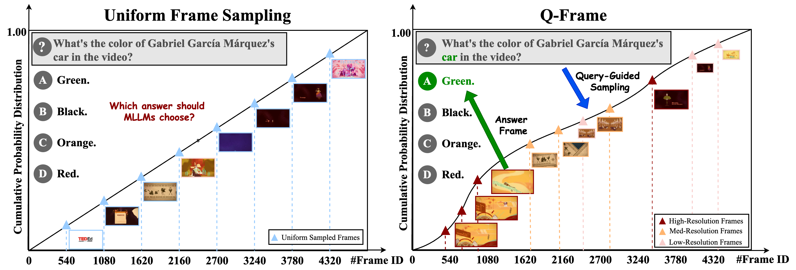
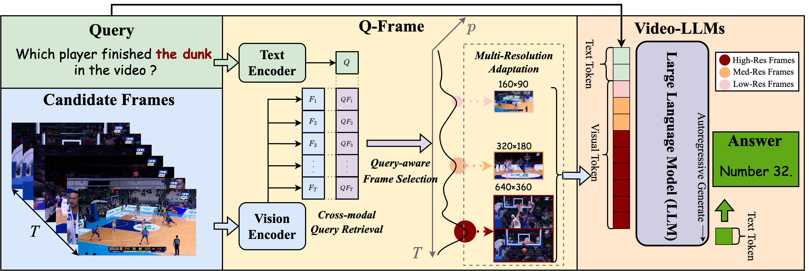
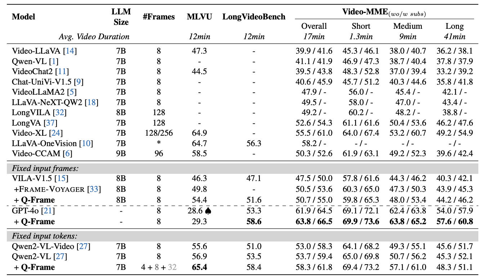

# Q-Frame: Query-aware Frame Selection and Multi-Resolution Adaptation for Video-LLMs

<p align="center">
📖 <a href="https://arxiv.org/abs/2506.22139" target="_blank">arXiv</a> · ⭐ <a href="https://github.com/xiaomi-research/q-frame" target="_blank">GitHub</a>
</p>

## 📰 News
🚀 **[2025-9-21]** Q-Frame has been adopted in [The 1st Solution for 7th LSVOS RVOS Track: SaSaSa2VA](https://arxiv.org/abs/2509.16972)

🚀 **[2025-8-26]** Our code is now available on Github.

🚀 **[2025-6-29]** Our paper "Q-Frame: Query-aware Frame Selection and Multi-Resolution Adaptation for Video-LLMs" is now available on arXiv.

🚀 **[2025-6-26]** Our paper "Q-Frame: Query-aware Frame Selection and Multi-Resolution Adaptation for Video-LLMs" accepted at ICCV 2025.


## Abstract

Multimodal Large Language Models (MLLMs) have demonstrated significant success in visual understanding tasks. However, challenges persist in adapting these models for video comprehension due to the large volume of data and temporal complexity. Existing Video-LLMs using uniform frame sampling often struggle to capture the query-related crucial spatiotemporal clues of videos effectively. In this paper, we introduce Q-Frame, a novel approach for adaptive frame selection and multi-resolution scaling tailored to the video's content and the specific query. Q-Frame employs a training-free, plug-and-play strategy generated by a text-image matching network like CLIP, utilizing the Gumbel-Max trick for efficient frame selection. Q-Frame allows Video-LLMs to process more frames without exceeding computational limits, thereby preserving critical temporal and spatial information. We demonstrate Q-Frame's effectiveness through extensive experiments on benchmark datasets, including MLVU, LongVideoBench, and Video-MME, illustrating its superiority over existing methods and its applicability across various video understanding tasks.

## Contribution of Q-Frame



- We introduce **Q-Frame**, a novel framework for queryaware frame selection and multi-resolution frame scaling that improves long-form video understanding by focusing on the most relevant visual content for a given query.

- We propose a training-free, plug-and-play mechanism that leverages a CLIP-based vision-language model to guide frame selection and resolution assignment *without* any additional model training or fine-tuning.

- We validate the effectiveness of Q-Frame through extensive experiments on three benchmark datasets (MLVU, LongVideoBench, and Video-MME, demonstrating its superiority over previous methods and its practical usability for video understanding tasks.

## Performance Highlights

- 🏆 MLVU: Qwen2-VL-7B *w/* Q-Frame achieves **65.4** accuracy (+8.5)
- 🏆 LongVideoBench: GPT-4o *w/* Q-Frame achieves **58.6** accuracy (+5.3)
- 🏆 Video-MME: GPT-4o *w/* Q-Frame achieves **solid improvements** on various tasks and video durations.




## Quick Start

### Installation

- Please install the [lmms-eval](https://github.com/EvolvingLMMs-Lab/lmms-eval) following the [installation](https://github.com/EvolvingLMMs-Lab/lmms-eval?tab=readme-ov-file#installation) of lmms-eval.

```bash
conda create lmms-eval python==3.10.13
conda activate lmms-eval
pip install -e .
```

### Preparation

Please fisrt clone the [Long-CLIP](https://github.com/beichenzbc/Long-CLIP.git) from github by running the following command.

```bash
git clone https://github.com/beichenzbc/Long-CLIP.git
```

Then, download the checkpoints of the pretrained model [LongCLIP-B](https://huggingface.co/BeichenZhang/LongCLIP-B) and/or [LongCLIP-L](https://huggingface.co/BeichenZhang/LongCLIP-L) and place it under `./Long-CLIP/checkpoints`

### Usage

1. Before conducting experiments on Q-Frame, please make sure you can run the experimental scripts of baselines successfully.

```bash
# For LongVideoBench
bash experiments/longvideobench/gpt4o/baseline.sh
bash experiments/longvideobench/qwen2vl/baseline.sh

# For MLVU
bash experiments/mlvu/gpt4o/baseline.sh
bash experiments/mlvu/qwen2vl/baseline.sh

# For Video-MME
bash experiments/videomme/gpt4o/baseline.sh
bash experiments/videomme/qwen2vl/baseline.sh

# For Video-MME w subtitle
bash experiments/videomme_w_subtitle/gpt4o/baseline.sh
bash experiments/videomme_w_subtitle/qwen2vl/baseline.sh
```

2. Now, you can reproduce the performance of Q-Frame.

```bash
# For LongVideoBench
bash experiments/longvideobench/gpt4o/qframe.sh
bash experiments/longvideobench/qwen2vl/qframe.sh

# For MLVU
bash experiments/mlvu/gpt4o/qframe.sh
bash experiments/mlvu/qwen2vl/qframe.sh

# For Video-MME
bash experiments/videomme/gpt4o/qframe.sh
bash experiments/videomme/qwen2vl/qframe.sh

# For Video-MME w subtitle
bash experiments/videomme_w_subtitle/gpt4o/qframe.sh
bash experiments/videomme_w_subtitle/qwen2vl/qframe.sh
```

#### Command-line Arguments:
- max_num_frames: the number of candidate frames sampled from a video.
- sample_frames: the number of frames fed into Video-LLMs.
- high_frames: the number of high resolution video frames.
- mid_frames: the number of medium resolution video frames.
- low_frames: the number of low resolution video frames.

Note: 
- For the fix frames experimental settings: 
    - sample&#95;frames = high&#95;frames
    - mid&#95;frames = low&#95;frames = 0
- For the fix tokens experimental settings:
    - sampled&#95;frames = high&#95;frames + mid&#95;frames/4 + low&#95;frames/16

## Acknowledgement

- [lmms-eval](https://github.com/EvolvingLMMs-Lab/lmms-eval): One for All Modalities Evaluation Toolkit - including text, image, video, audio tasks.
- [Long-CLIP](https://github.com/beichenzbc/Long-CLIP.git): [ECCV 2024] Long-CLIP: Unlocking the Long-Text Capability of CLIP
- [VILA](https://github.com/NVlabs/VILA): VILA is a family of state-of-the-art vision language models (VLMs) for diverse multimodal AI tasks across the edge, data center, and cloud.
- [Qwen2-VL](https://github.com/QwenLM/Qwen2.5-VL): Qwen2-VL is the multimodal large language model series developed by Qwen team, Alibaba Cloud.
- [GPT-4o](https://openai.com/index/hello-gpt-4o/): A closed-source multimodal large model developed by OpenAI.

## Citation

Please cite this work if you find it useful:

```bib
@article{zhang2025QFrame,
    title={Q-Frame: Query-aware Frame Selection and Multi-Resolution Adaptation for Video-LLMs},
    author={Shaojie Zhang, Jiahui Yang, Jianqin Yin, Zhenbo Luo, Jian Luan},
    journal={arXiv preprint arXiv:2506.22139},
    year={2025}
    }
```